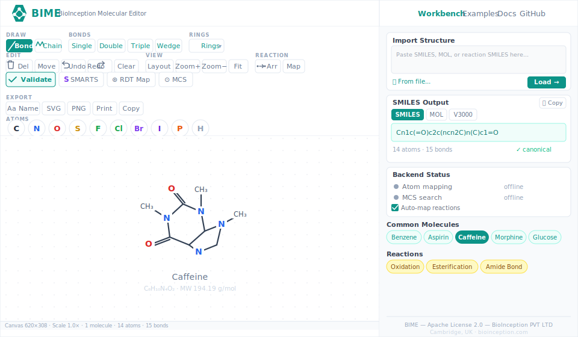

<p align="center">
  
</p>

<h1 align="center">BIME — BioInception Molecular Editor</h1>

<p align="center">
  <strong>The Modern Open-Source Molecule Editor</strong><br>
  Draw molecules, reactions, and SMARTS queries in your browser.<br>
  Pure JavaScript. Zero dependencies. 1181 built-in molecules.
</p>

<p align="center">
  <a href="LICENSE.txt"></a>
  <a href="https://asad.github.io/bime-dist/workbench.html"></a>
  <a href="https://github.com/asad/bime-dist/stargazers"></a>
  <a href="https://github.com/asad/bime-dist/network/members"></a>
  <a href="https://github.com/asad/bime-dist/issues"></a>
  
  
  
</p>

<p align="center">
  <a href="https://asad.github.io/bime-dist/workbench.html"><strong>Live Demo</strong></a> &nbsp;|&nbsp;
  <a href="https://asad.github.io/bime-dist/docs.html"><strong>Documentation</strong></a> &nbsp;|&nbsp;
  <a href="docs/USAGE.md"><strong>User &amp; Developer Guide</strong></a> &nbsp;|&nbsp;
  <a href="#quick-start"><strong>Quick Start</strong></a> &nbsp;|&nbsp;
  <a href="https://github.com/asad/bime-dist/issues"><strong>Report Issue</strong></a>
</p>

---



---

## Why BIME?

- **Pure JavaScript + SVG** — no compile step, no transpilation, no build tools
- **Runs entirely in the browser** — zero backend, zero external network calls
- **Chemically sound** — strict SMILES validation, valence checking, Huckel aromaticity
- **Responsive** — works on desktop, tablet, and phone with touch + pinch-to-zoom
- **Reaction-aware** — built-in reaction arrows and manual atom-mapping labels
- **SMARTS search & MCS** — VF2 substructure matching, in-browser SMSD MCS, fingerprint similarity
- **Free and open** — Apache 2.0 license, fully auditable source code
- **Drop anywhere** — no server needed, runs from a local file or any static host including GitHub Pages

### What's included

- **1181 validated molecules** — drugs, amino acids, nucleotides, vitamins
  (PubChem-canonical SMILES, audited for aromaticity / stereo / duplicates)
- **10 drawing tools** — atom, bond, ring, chain, stereo, delete, move, reaction, mapping
- **SMARTS substructure search** — VF2 matching with full query constraints
- **In-browser MCS & similarity** — SMSDMCS module, path-fingerprint Tanimoto, no server required
- **CIP stereochemistry** — R/S and E/Z assignment
- **Image export** — SVG, PNG (up to 4x resolution), clipboard copy
- **Local molecule naming** — auto-lookup from the 1181-molecule database
- **610-test regression suite** — `node tools/run-tests.js` (~600 ms, zero deps)
- **Zero dependencies** — no npm, no bundler, no build step

> **Atom-atom mapping (AAM)** ships as a pure-JS implementation (since v1.1.0),
> covering the full RDT algorithm: MIN/MAX/MIXTURE/RING strategies, bond-change
> annotation, and ring-preservation scoring — all in-browser, zero server required.

---

## Quick Start

### Three lines to embed BIME in any web page

```html
<!-- 1. Include BIME -->
<script src="https://asad.github.io/bime-dist/editor/Molecule.js"></script>
<script src="https://asad.github.io/bime-dist/editor/Layout.js"></script>
<script src="https://asad.github.io/bime-dist/editor/Templates.js"></script>
<script src="https://asad.github.io/bime-dist/editor/SmilesParser.js"></script>
<script src="https://asad.github.io/bime-dist/editor/SmilesWriter.js"></script>
<script src="https://asad.github.io/bime-dist/editor/MolfileWriter.js"></script>
<script src="https://asad.github.io/bime-dist/editor/Renderer.js"></script>
<script src="https://asad.github.io/bime-dist/editor/History.js"></script>
<script src="https://asad.github.io/bime-dist/editor/Tools.js"></script>
<script src="https://asad.github.io/bime-dist/editor/CipStereo.js"></script>
<script src="https://asad.github.io/bime-dist/editor/SmartsParser.js"></script>
<script src="https://asad.github.io/bime-dist/editor/SmartsMatch.js"></script>
<script src="https://asad.github.io/bime-dist/editor/SmartsWriter.js"></script>
<script src="https://asad.github.io/bime-dist/editor/ImageExport.js"></script>
<script src="https://asad.github.io/bime-dist/editor/MolEditor.js"></script>

<!-- 2. Add a container -->
<div id="editor" style="width:100%;height:460px"></div>

<!-- 3. Initialize -->
<script>
  var editor = new MolEditor('editor', '100%', '460px');
  editor.readGenericMolecularInput('c1ccccc1');  // load benzene
</script>
```

### Or clone and open locally (no server needed)

```bash
git clone https://github.com/asad/bime-dist.git
cd bime && open workbench.html
```

---

## Features

### Drawing & Editing

| Feature | Description |
|---------|-------------|
| Atom tool | Place any element from the periodic table |
| Bond tools | Single, double, triple bonds with click-to-cycle |
| Ring templates | 3- to 7-membered rings, benzene, naphthalene, indole, steroid skeleton |
| Chain tool | 120-degree zigzag carbon chains |
| Stereo bonds | Wedge (up) and dash (down) for chirality |
| Reaction arrow | Draw reaction SMILES with reactants and products |
| Atom-atom mapping | Number atoms across a reaction for correspondence |
| Selection & move | Drag atoms and fragments, lasso select |
| Undo / redo | Full history stack with Ctrl+Z / Ctrl+Y |
| Delete tool | Remove atoms, bonds, or fragments |

### Chemistry Engine

| Feature | Description |
|---------|-------------|
| SMILES parser | Strict recursive-descent parser with detailed error messages |
| SMILES writer | Canonical output using Morgan algorithm + Huckel 4n+2 aromaticity |
| Reaction SMILES | Full `>>` reaction notation with atom maps |
| SMARTS parser | Pattern queries with logical operators, recursive SMARTS |
| SMARTS matching | VF2 subgraph isomorphism with atom/bond constraints |
| Valence checking | Real-time validation with colour-coded warnings |
| CIP stereochemistry | R/S assignment for tetrahedral centres, E/Z for double bonds |
| Ring perception | SSSR via Horton/Gaussian elimination, fused ring detection |
| Aromaticity | Huckel 4n+2 rule, Kekulisation, aromatic circle rendering |

### Export & Integration

| Feature | Description |
|---------|-------------|
| SMILES output | Canonical SMILES string |
| MOL V2000 | Standard MDL molfile format |
| MOL V3000 | Extended molfile for large molecules |
| SVG export | Vector graphics, publication quality |
| PNG export | Raster at 1x, 2x, or 4x resolution |
| Print-ready SVG | CMYK-safe colours, thicker bonds |
| Batch export | Convert arrays of SMILES to SVG/PNG programmatically |
| Clipboard copy | One-click copy to clipboard |
| Callbacks | `AfterStructureModified`, `AtomHighlight`, `BondHighlight`, `AtomClicked`, `BondClicked` |

### Platform

| Feature | Description |
|---------|-------------|
| Desktop browsers | Chrome, Firefox, Safari, Edge |
| Mobile / tablet | Touch events, pinch-to-zoom, responsive layout |
| Dark mode | Built-in CSS custom properties, auto-detects system preference |
| Offline | No server, no CDN required -- runs from `file://` |
| Embedding | Drop into any HTML page with `<script>` tags |

---

## API Reference

### Constructor

```javascript
var editor = new MolEditor('container', '100%', '460px', {
    options: 'hydrogens,depict',  // comma-separated flags
    smiles: 'c1ccccc1'           // optional initial structure
});
```

### Essential Methods

```javascript
// Read & write structures
editor.readGenericMolecularInput('CCO');   // load SMILES or MOL data
editor.smiles();                            // get canonical SMILES
editor.molFile(false);                      // MOL V2000 (true = V3000)
editor.getMolecularAreaGraphicsString();     // SVG markup

// Validation
editor.validateSmiles('c1ccccc1');
// => { valid: true, atoms: 6, bonds: 6, smiles: 'c1ccccc1', error: null, warnings: [] }

editor.validateSmiles('C1CCC');
// => { valid: false, error: 'Unclosed ring 1 opened at position 1' }

// Callbacks
editor.setCallBack('AfterStructureModified', function(event) {
    document.getElementById('output').textContent = event.src.smiles();
});

// Editor control
editor.reset();                // clear canvas
editor.setSize('800px', '600px');  // resize
editor.repaint();              // force re-render

// Atom & bond access
editor.totalNumberOfAtoms();   // atom count
editor.totalNumberOfBonds();   // bond count
editor.getAtom(0, idx);        // {x, y, atom, charge, isotope, mapNumber}
editor.getBond(0, idx);        // {atom1, atom2, bondType, stereo}
```

### Image Export API

```javascript
// SVG string
var svg = ImageExport.toSVG(mol, { width: 800, height: 600 });

// High-res PNG (returns Promise<Blob>)
ImageExport.toPNG(mol, { scale: 4 }).then(function(blob) {
    saveAs(blob, 'molecule.png');
});

// Print-ready SVG with CMYK-safe colours
var printSvg = ImageExport.toPrintSVG(mol);

// Batch convert
var svgs = ImageExport.batchSVG([
    { name: 'Aspirin', smiles: 'CC(=O)OC1=CC=CC=C1C(=O)O' },
    { name: 'Caffeine', smiles: 'Cn1cnc2c1c(=O)n(c(=O)n2C)C' }
]);
```

### Keyboard Shortcuts

| Key | Action |
|-----|--------|
| `Ctrl+Z` | Undo |
| `Ctrl+Y` / `Ctrl+Shift+Z` | Redo |
| `Delete` / `Backspace` | Delete tool |
| Mouse wheel | Zoom in/out |
| Pinch (touch) | Zoom in/out |

---

## Architecture

```
bime/
 editor/
  Molecule.js        Molecular graph data model
  Layout.js          2D coordinate generation (SSSR, fused rings, chains)
  Templates.js       Ring & scaffold templates
  SmilesParser.js    Strict SMILES parser with validation
  SmilesWriter.js    Canonical SMILES writer (Morgan, Huckel)
  MolfileWriter.js   MOL V2000/V3000 export
  Renderer.js        SVG rendering engine
  ImageExport.js     SVG/PNG/print export, clipboard
  History.js         Undo/redo stack
  Tools.js           Interactive drawing tools
  CipStereo.js       CIP R/S and E/Z stereochemistry
  SmartsParser.js    SMARTS pattern parser
  SmartsMatch.js     VF2 substructure matching
  SmartsWriter.js    SMARTS pattern writer
  MolEditor.js       Main editor (UI, toolbar, API)
 common-molecules.js 1181 validated drug molecules
 images/svg/         21 teal SVG toolbar icons
 css/style.css       Design system with dark mode
 workbench.html      Full editor workbench
 docs.html           API documentation (HTML)
 docs/USAGE.md       User & developer guide (Markdown, full UI walkthrough)
 screenshots.html    Live rendering gallery
 tests/              22 regression test files (610 tests, ~600 ms)
 tools/run-tests.js  Test runner (plain Node, zero deps)
 tools/audit-aromatic.js  Aromaticity / stereo / duplicate auditor
```

---

## Browser-only by design

BIME v1.x runs entirely in the browser. There is no install, no server, and no
external network call — the editor refuses connections to anything other than
its own origin (CSP `connect-src 'self'`). Drop the files on any static host
(or open `workbench.html` directly from disk) and it works.

A pure-JavaScript atom-atom mapping (AAM) implementation ships since **v1.1.0**,
covering the educational reactions chemistry students actually meet
(esterification, SN2, Diels–Alder, Claisen, amide formation, hydration).

---

## Ecosystem

| Project | Description | Link |
|---------|-------------|------|
| **SMSD** | Small Molecule Subgraph Detector -- maximum common substructure (MCS) and substructure searching. The MCS / similarity bits used by BIME run as a bundled JS port; no server required. | [github.com/asad/SMSD](https://github.com/asad/SMSD) |
| **ReactionDecoder (RDT)** | Java atom-atom mapping engine for balanced chemical reactions. BIME ships a pure-JS port of the published RDT algorithm (4 strategies + bond-change annotation) since v1.1.0. | [github.com/asad/ReactionDecoder](https://github.com/asad/ReactionDecoder) |
| **EC-BLAST** | Enzyme mechanism comparison tool that uses bond-change analysis to classify enzymatic reactions. | [github.com/asad/EC-BLAST](https://github.com/asad/EC-BLAST) |

---

## Documentation

BIME ships with audience-tailored guides under `docs/`:

| Guide | Who it's for |
|---|---|
| **[docs/USAGE.md](docs/USAGE.md)** | Comprehensive user guide — every feature, every keyboard shortcut, the full programmatic API |
| **[docs/STUDENTS.md](docs/STUDENTS.md)** | Students learning chemistry — SMILES primer, drawing recipes, common molecules |
| **[docs/EDUCATORS.md](docs/EDUCATORS.md)** | Teachers / professors — lesson plans, printable worksheets, LMS embedding, assessment ideas |
| **[docs/RESEARCHERS.md](docs/RESEARCHERS.md)** | Cheminformatics researchers — programmatic API, batch pipelines, MCS/AAM, citing |
| **[docs/HOSTING.md](docs/HOSTING.md)** | Self-hosting — GitHub Pages, Netlify, Cloudflare Pages, Apache, Nginx, Docker, IPFS, USB stick |
| **[docs/EMBED.md](docs/EMBED.md)** | Developers embedding BIME — script tags, iframe, bundle+SRI, Jupyter, React/Vue/Svelte, LMS |
| **[CONTRIBUTING.md](CONTRIBUTING.md)** | How to contribute code, docs, molecules, translations |
| **[CODE_OF_CONDUCT.md](CODE_OF_CONDUCT.md)** | Community standards (Contributor Covenant 2.1) |
| **[SUPPORT.md](SUPPORT.md)** | Where to get help, how to file an issue, security disclosure |
| **[CHANGELOG.md](CHANGELOG.md)** | All notable changes per Keep-a-Changelog |

---

## Contributing

Contributions are welcome from chemists, software engineers, educators, students, and researchers worldwide. BIME is written in plain ES5 JavaScript with no build tools, so getting started is straightforward.

**Read the full [CONTRIBUTING.md](CONTRIBUTING.md)** for the complete development setup, coding style, commit conventions, PR workflow, and how to add molecules to the database.

### Quick start

```bash
git clone https://github.com/asad/bime-dist.git
cd bime
open workbench.html              # start editing and testing immediately
node tools/run-tests.js          # 610 tests, ~600 ms, zero deps
node tools/audit-aromatic.js     # validates all 1181 SMILES in the database
```

### Reporting issues

Use the **professional issue tracker** with structured templates:

- 🐛 [Bug report](https://github.com/asad/bime-dist/issues/new?template=bug_report.md) — for reproducible bugs
- 💡 [Feature request](https://github.com/asad/bime-dist/issues/new?template=feature_request.md) — for new ideas
- ❓ [Question](https://github.com/asad/bime-dist/issues/new?template=question.md) — for usage help

For **security vulnerabilities**, please email **asad.rahman@bioinceptionlabs.com** privately — do **not** open a public issue. See [SUPPORT.md § Security](SUPPORT.md#-security-vulnerability) for the disclosure process.

---

## Build and verify

BIME v1.7.0 ships pre-built bundles in `dist/`. The source in `editor/`
is the canonical Apache-2.0 release; the bundles are a deployment
optimisation (~50% smaller, single HTTP request). There is **no
obfuscation** — the bundle is the same JavaScript, just whitespace-
and comment-stripped. Symbol names, control flow and semantics are
preserved.

To rebuild from source (zero npm dependencies):

```bash
node tools/build.js
```

This concatenates `editor/*.js`, writes `dist/bime.js` and
`dist/bime.min.js`, regenerates `dist/MANIFEST.sha256` and `dist/SRI.txt`,
and re-runs the full regression suite against both bundles before
exiting.

To verify a downloaded bundle has not been tampered with:

```bash
cd dist
shasum -a 256 -c MANIFEST.sha256
```

To use the bundle in your page (with browser-side tamper detection):

```html
<script
    src="dist/bime.min.js"
    integrity="sha384-..."           <!-- copy from dist/SRI.txt -->
    crossorigin="anonymous"></script>
```

To verify the GPG signature on a signed release tag:

```bash
git tag -v v1.7.0
```

(See `tools/sign-release.sh` for signing helpers — opt-in, recommended
for maintainers cutting a release.)

---

## Citation

If you use BIME in academic work, please cite:

```bibtex
@software{rahman2026bime,
  author       = {Rahman, Syed Asad},
  title        = {{BIME}: {B}io{I}nception {M}olecular {E}ditor},
  year         = {2026},
  publisher    = {BioInception PVT LTD},
  address      = {Cambridge, UK},
  url          = {https://github.com/asad/bime-dist},
  note         = {Open-source browser-based molecule editor for chemical
                  structures, reactions, and SMARTS queries}
}
```

> S. A. Rahman, **BIME: BioInception Molecular Editor**,
> BioInception PVT LTD, Cambridge, UK (2026).
> [https://github.com/asad/bime-dist](https://github.com/asad/bime-dist)

---

## Suggested Repository Topics

For maximum GitHub discoverability, add these topics to the repository:

`molecule-editor` `chemistry` `smiles` `smarts` `cheminformatics` `molecular-editor` `svg` `javascript` `drug-discovery` `reaction-mapping` `open-source` `bioinformatics` `computational-chemistry` `molecule-drawing` `chemical-structure` `atom-atom-mapping`

---

## License

**Apache License 2.0**

Copyright (c) 2026 BioInception PVT LTD, Cambridge, UK and Syed Asad Rahman. All rights reserved.

Free to use, modify, and redistribute with attribution. See [LICENSE.txt](LICENSE.txt).

---

<p align="center">
  Built with care by <a href="https://www.bioinceptionlabs.com">BioInception PVT LTD, Cambridge, UK</a>
</p>
