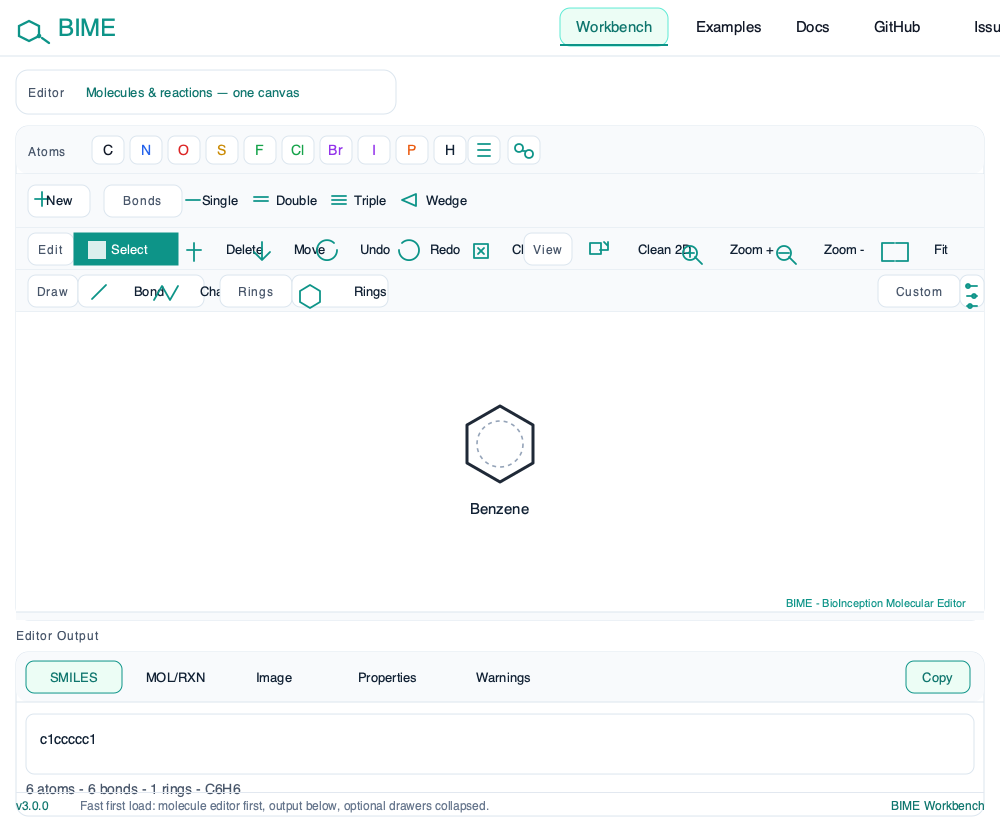
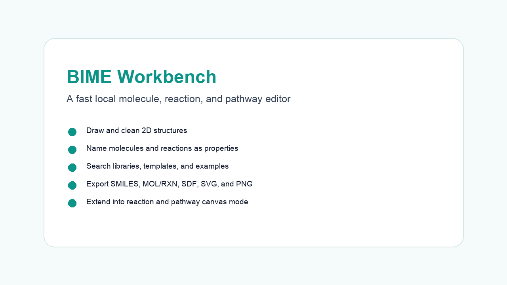
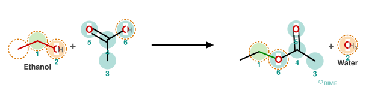

<p align="center">
  
</p>

<h1 align="center">BIME<sup>™</sup> — BioInception<sup>™</sup> Molecular Editor</h1>

<p align="center">
  Browser-based 2D molecule editor for SMILES, SMARTS, and reactions.<br>
  Pure JavaScript. Zero dependencies. Signed releases.
</p>

<p align="center">
  <a href="LICENSE.txt"></a>
  <a href="https://asad.github.io/bime-dist/workbench.html"></a>
  
  
</p>

<p align="center">
  <a href="https://asad.github.io/bime-dist/workbench.html"><strong>Try in browser</strong></a> &nbsp;|&nbsp;
  <a href="https://asad.github.io/bime-dist/docs.html"><strong>API docs</strong></a> &nbsp;|&nbsp;
  <a href="#quick-start"><strong>Embed in 3 lines</strong></a>
</p>

---



---

## Demo walkthrough



The walkthrough covers the main user flow: draw and clean structures, edit
properties, quick-load examples, search the built-in library, label reactions,
export outputs, and draw reactions with `>>` on the same canvas. An optional JSX
storyboard source is available at
[`tools/demo/DemoWalkthrough.jsx`](tools/demo/DemoWalkthrough.jsx).

---

## Quick start

### Download, build, and run

Use the public release repo when you only want to run or embed BIME:

```bash
git clone https://github.com/asad/bime-dist.git
cd bime-dist
python3 -m http.server 8080
# open http://localhost:8080/workbench.html
```

To download without `git`:

```bash
curl -L https://github.com/asad/bime-dist/archive/refs/heads/main.zip -o bime-dist.zip
unzip bime-dist.zip
cd bime-dist-main
python3 -m http.server 8080
```

BIME is a static browser app, so there is no install step for normal use.
Opening `workbench.html` directly also works in modern browsers. The local
server command above is recommended for the closest production-like preview.

To rebuild the compiled browser bundle from a source checkout:

```bash
node tools/build.js
```

That command writes `dist/bime.js`, `dist/bime.min.js`,
`dist/MANIFEST.sha256`, and `dist/SRI.txt`, then tests both bundles.
Node 18+ is recommended. No `npm install` is required for the standard
build/test flow.

### Embed in your page

A script tag, a container, and an init call — no build step, no npm, no server.

```html
<script src="https://asad.github.io/bime-dist/dist/bime.min.js"></script>
<div id="editor" style="width:100%;height:460px"></div>
<script>
  var editor = new MolEditor('editor', '100%', '460px');
  editor.readGenericMolecularInput('c1ccccc1');
</script>
```

### Or open the checked-out workbench directly

```bash
git clone https://github.com/asad/bime-dist.git
cd bime-dist && open workbench.html
```

The editor runs entirely in the browser and makes no external network
calls. The pre-built `dist/bime.min.js` is about 900 KiB minified and ships
with SHA-384 Subresource Integrity hashes for browser-side tamper
detection.

### Workbench extras

The workbench is the recommended product surface. It keeps the molecule
canvas first, then adds quick loading, compound lookup, library search,
output tabs, visual templates, molecule/reaction identity properties,
reaction labels, and export presets.

The same engine is available headlessly from the command line — SMILES
parsing, canonical layout, atom-atom mapping, publication-quality
mapped-reaction figures, and export:

```bash
bime version
bime parse 'CC(=O)Oc1ccccc1C(=O)O'
bime aam 'CCO>>CC=O' --format json
bime aam 'CCO.CC(=O)O>>CCOC(=O)C.O' --format svg --out reaction.svg   # mapped-reaction figure
bime export 'c1ccccc1' --format svg --out benzene.svg
```

`bime aam … --format svg` produces a publication-ready mapped-reaction
figure — atom-atom map numbers, bond-change colours (red cleaved, green
formed, amber order), and reaction-centre rings:



Install the CLI with `npm install -g bime-dist`, or download a
standalone binary (no Node required) from the
[latest release](https://github.com/asad/bime-dist/releases/latest).
Full command reference, flags, and how-to recipes are in
**[`CLI.md`](CLI.md)**.

---

## API

### Read & write

```javascript
var editor = new MolEditor('container', '100%', '460px');

editor.readGenericMolecularInput('CCO');     // load SMILES or MOL
editor.smiles();                              // canonical SMILES
editor.molFile(false);                        // MOL V2000
editor.getMolecularAreaGraphicsString();      // SVG markup
```

### Validate

```javascript
editor.validateSmiles('c1ccccc1');
// => { valid: true, atoms: 6, bonds: 6, ... }
```

### Events

```javascript
editor.setCallBack('AfterStructureModified', function (e) {
  console.log(e.src.smiles());
});
```

### Image export

```javascript
ImageExport.toSVG(mol, { width: 800, height: 600 });
ImageExport.toPNG(mol, { scale: 4 }).then(function (blob) { /* ... */ });
```

Full API reference: [`docs.html`](https://asad.github.io/bime-dist/docs.html).

---

## Build

BIME ships pre-built bundles in `dist/`. To rebuild from source:

```bash
node tools/build.js
```

This concatenates `editor/*.js` into `dist/bime.js` and `dist/bime.min.js`,
regenerates `dist/MANIFEST.sha256` and `dist/SRI.txt`, and re-runs the
regression suite against both bundles before exiting.

To use the bundle with browser-side tamper detection:

```html
<script src="dist/bime.min.js"
        integrity="sha384-..."           <!-- copy from dist/SRI.txt -->
        crossorigin="anonymous"></script>
```

To verify a downloaded bundle:

```bash
cd dist && shasum -a 256 -c MANIFEST.sha256
```

---

## Test

```bash
node tools/run-tests.js
```

Plain Node, zero deps. That command runs the fast source suite. The full release gate is `node tools/release-check.js`, which runs source tests, integration checks, bundle tests, minified-bundle tests, manifest verification, SRI verification, version checks, and build-drift checks.

---

## Citation

```bibtex
@software{rahman2026bime,
  author       = {Rahman, Syed Asad},
  title        = {{BIME}: {B}io{I}nception {M}olecular {E}ditor},
  year         = {2026},
  publisher    = {BioInception PVT LTD},
  address      = {Cambridge, UK},
  url          = {https://github.com/asad/bime-dist}
}
```

---

## Acknowledgments

BIME is released in the year I turn 50 — a small gift back to the
research and student community that has given me so much.

I am deeply grateful to my mentors —
Prof. [Seyed E. Hasnain](https://en.wikipedia.org/wiki/Seyed_E._Hasnain),
Prof. [Dietmar Schomburg](https://de.wikipedia.org/wiki/Dietmar_Schomburg),
Prof. [Christoph Steinbeck](https://en.wikipedia.org/wiki/Christoph_Steinbeck),
and Prof. Dame [Janet Thornton](https://en.wikipedia.org/wiki/Janet_Thornton) —
whose guidance, insight, and uncompromising standards laid the foundation
of this work and shaped the scientist I became.

I am equally indebted to the colleagues I was privileged to work
alongside during my doctoral and postdoctoral years, whose curiosity,
generous exchange of ideas, and unwavering dedication were a daily
source of inspiration and shaped the way I think about science to this day.

To the next generation of students and early-career researchers:
I hope BIME sparks in you the same curiosity that was once kindled in me.

— *Syed Asad Rahman*

---

## License

Apache License 2.0 — see [`LICENSE.txt`](LICENSE.txt).

Copyright (c) 2026 BioInception PVT LTD, Cambridge, UK and Syed Asad Rahman.

---

## Contact

For questions, issues, or commercial enquiries:
**info@bioinceptionlabs.com**

<p align="center">
  <a href="https://www.bioinceptionlabs.com">BioInception PVT LTD, Cambridge, UK</a>
</p>
